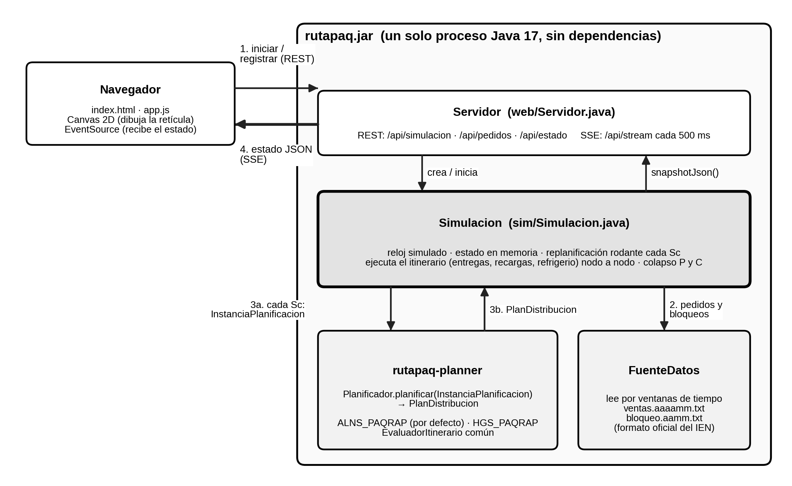

# RUTAPAQ — servidor, simulación y visualizador con rutapaq-planner (ALNS y GA)

Un solo proceso Java 17 **sin dependencias en ejecución**. Contiene, sin modificaciones, el código de
**rutapaq-planner v2.0** (`pe.pucp.paqrap.planner`: ALNS_PAQRAP, HGS_PAQRAP, EvaluadorItinerario y
el banco del IEN) y, alrededor de él, la simulación en tiempo real y el visualizador web
(`pe.pucp.paqrap.app`).



## Ejecutar

```bash
mvn package                       # o ./compilar-sin-maven.sh
cp target/rutapaq.jar .
java -jar rutapaq.jar             # http://localhost:8080
```

En el navegador: **Simulación de 5 días**, una fecha con datos (p. ej. `2026-01-01` o `2027-06-01`) e
**Iniciar**. La carpeta `datos/` trae el historial sintético de rutapaq-planner (21 meses entre 2026 y 2028,
con demanda creciente); para usar los datos oficiales basta con reemplazar esos archivos.

Sin interfaz (corre lo más rápido posible e imprime indicadores cada 12 h):

```bash
java -jar rutapaq.jar probar 2026-01-01 120            # 5 días
java -jar rutapaq.jar probar 2027-03-01 240 COLAPSO    # hasta el colapso (o 240 h)
```

El banco experimental del IEN sigue funcionando igual desde el mismo jar:

```bash
java -cp rutapaq.jar pe.pucp.paqrap.planner.ien.RunnerIEN --bloques=8
```

## Cómo se usa rutapaq-planner

En cada ciclo (cada `ien.scMinutos` minutos simulados), `Simulacion.planificar()` hace lo mismo que
el `SimuladorColapso` del IEN, pero sobre el estado en vivo:

1. Cada unidad conserva solo la parada hacia la que ya se está moviendo; el resto de su itinerario se libera.
2. Arma la `InstanciaPlanificacion`: un `Vehiculo` por unidad (nodo, hora y carga con que queda libre,
   turno vigente y si ya tomó refrigerio), los `Almacen` con su saldo descontando las recargas
   comprometidas, los `Pedido` con lo que falta asignar (fraccionados con `LectorVentas.fraccionar`
   en partes de `ien.maximoProductosPorEntrega`) y la `MapaReticula` con los bloqueos vigentes.
3. Llama a `Planificador.planificar()` del algoritmo elegido (`planificador.algoritmo=ALNS` o `GA`).
4. Convierte el `PlanDistribucion` en el itinerario de cada unidad: entregas, recargas y refrigerios
   tal como los colocó el `EvaluadorItinerario`.

Entre ciclos, las unidades recorren la **misma** `MapaReticula` nodo a nodo (camino mínimo que no
atraviesa bloqueos) y ejecutan su itinerario. Se aplican las mismas reglas que el planner: el plazo se
cumple con la hora de llegada, cada entrega toma 1 h, el refrigerio dura 1 h, las recargas no toman
tiempo y los intermedios vuelven a 1 000 unidades a las 23:59:59.

Colapso (escenario hasta el colapso): **P** cuando un pedido llega a su límite sin entrega;
**C** cuando una ejecución del planificador tarda `ien.saSegundos` o más.

## Configuración

| Archivo | Qué contiene |
|---|---|
| `planner.properties` (de rutapaq-planner, sin cambios) | Mapa, almacenes, flota, Sc, Sa, P, parámetros de ALNS y GA |
| `config.properties` | Servidor, algoritmo, escenarios, frecuencia de publicación y semáforo |

Un `config.properties` junto al jar sobrescribe cualquier clave de los dos archivos, sin recompilar.

## Estructura

| Paquete | Qué hace |
|---|---|
| `pe.pucp.paqrap.planner.*` | rutapaq-planner v2.0, sin cambios (`model`, `core`, `alns`, `hgs`, `ien`) |
| `app.sim.Simulacion` | Reloj, estado en memoria, ciclo de planificación con rutapaq-planner, ejecución, colapso |
| `app.sim.Caminos` | Caminos nodo a nodo sobre la `MapaReticula` del planner |
| `app.sim.Planificadores` | Crea `ALNS_PAQRAP` o `HGS_PAQRAP` según la configuración |
| `app.sim.Indicadores` | Semáforo con umbrales configurables |
| `app.datos` | Lectura de ventas y bloqueos línea por línea, en el formato oficial |
| `app.web.Servidor` | REST, SSE y archivos del visualizador |
| `resources/web` | Visualizador (Canvas 2D + EventSource) |

## Desplegar en la VM de AWS (Ubuntu 24.04)

Copiar a la VM `rutapaq.jar`, `config.properties`, `datos/` y `deploy/`, y ejecutar
`./deploy/instalar-en-vm.sh`. Instala Java 17 y Nginx, deja RUTAPAQ como servicio `systemd` en
`127.0.0.1:8080` y lo publica por Nginx en el puerto 80. Para HTTPS con dominio:
`sudo certbot --nginx -d su-dominio`.

## Diferencias con el SimuladorColapso del IEN (declararlas si se comparan resultados)

- El reloj avanza en pasos de 30 s y las unidades se mueven nodo a nodo; en el IEN, cada tramo se
  resuelve de una vez al ejecutar la ventana.
- El colapso P se detecta en el instante en que vence el plazo; en el IEN, al cerrar la ventana Sc.
- La unidad termina la parada hacia la que se mueve antes de recibir el nuevo plan; en el IEN termina
  el tramo en curso al cerrar la ventana.
- El evaluador cuenta el refrigerio antes de la siguiente llegada; aquí la unidad lo toma al llegar al
  nodo de esa parada, antes de atenderla (misma hora de atención).
